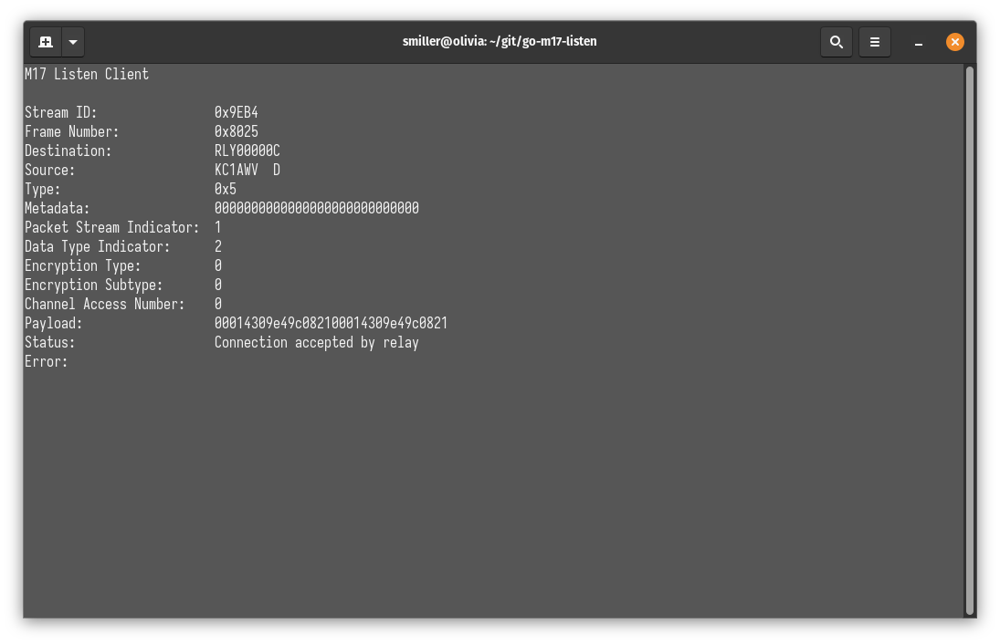
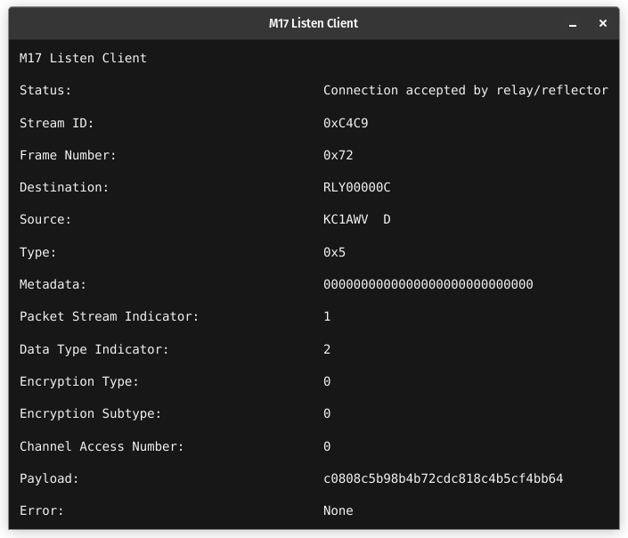

# go-m17-listen

`go-m17-listen` is a Go program that connects to an M17 relay or reflector as a listen-only client. It decodes M17 voice packets using the Codec 2 vocoder and plays the audio through the speakers.

## Features

- Connects to an M17 relay or reflector as a listen-only client.
- Decodes M17 voice packets using Codec 2.
- Plays decoded audio through the speakers.
- Handles optional module letters for mrefd reflectors.
- Gracefully shuts down and waits for a DISC packet from the relay.

## Installation

1. **Install Codec 2 Library**

   Follow the instructions on the [Codec 2 repository](https://github.com/drowe67/codec2) to install the Codec 2 library on your system.

2. **Install Go**

   Make sure you have Go installed on your system. You can download and install Go from the [official website](https://golang.org/dl/).

   **Recommended version: 1.20 or later.**

3. **Install any required dependencies**

   - GLFW and OpenGL Libraries:
      
      These are required for the fyne GUI library which depends on glfw for window management.
      Install the necessary development packages:

      ```bash
      sudo apt-get install libgl1-mesa-dev xorg-dev
      ```

   - X11 Development Libraries:

      These are required for glfw and other graphical dependencies.
      Install the necessary development packages:

      ```bash
      sudo apt-get install libx11-dev libxcursor-dev libxrandr-dev libxinerama-dev libxi-dev libxxf86vm-dev
      ```

   - ALSA (Advanced Linux Sound Architecture):

      Required for audio playback using the `oto` library.
      Install the necessary development package:

      ```bash
      sudo apt-get install libasound2-dev
      ```

3. **Clone the Repository**

   ```sh
   git clone https://github.com/kc1awv/go-m17-listen.git
   cd go-m17-listen
   ```

4. Install Go Dependencies

    ```sh
    go mod tidy
    ```

5. Run or build the Program

    - Build and run the program
    ```sh
    go build
    ./go-m17-listen [--tui | --gui] <relay_address>:<port> [module]
    ```

    - Run the program (without building)
    ```sh
    go run . [--tui | --gui] <relay_address>:<port> [module]
    ```

## Usage
- `--tui`: Run program with TUI interface
- `--gui`: Run program with GUI interface
- `<relay_address>`: The address of the M17 relay or reflector to connect to.
- `<port>`: The port the relay or reflector is listening on.
- `<module_letter>`: The optional module letter for mrefd reflectors.

### Example

- relay: `./go-m17-listen --gui 127.0.0.1:17000`
- mrefd: `./go-m17-listen --tui 127.0.0.1:17000 A`

#### TUI Interface


#### GUI Interface


## Configuration

The program generates a random 9-character callsign starting with "LSTN" followed by 5 random characters (letters A through Z and digits 0 through 9).

## Handling Packets

The program sends the following packets:

- `LSTN`: Send a listen-only connection request to the relay or reflector.
- `PONG`: Sends a PONG to the relay or reflector in response to a PING keepalive.
- `DISC`: Disconnect from the relay or reflector.

The program handles the following packet types:

- `PING`: Responds with a PONG packet.
- `ACKN`: Logs that the connection was accepted.
- `NACK`: Logs that the connection was not accepted and gracefully shuts down.
- `DISC`: Logs that a DISC packet was received and signals the program to shut down.
- `M17`: Decodes and plays the voice stream using Codec 2.

## Graceful Shutdown

When the program receives a termination signal (SIGINT or SIGTERM), it sends a DISC packet to the relay and waits for a DISC packet from the relay before closing the connection. If no DISC packet is received within 5 seconds, the program times out and closes the connection.

## License

This project is licensed under the GNU General Public License v3.0. See the LICENSE file for more details.

## Acknowledgements

[Codec 2](https://github.com/drowe67/codec2) - Open source low bit rate speech codec.

[Oto](https://github.com/ebitengine/oto) - A low-level library to play sound on multiple platforms.

[termbox-go](https://github.com/nsf/termbox-go) - Pure Go termbox implementation.

[Fyne.io](https://fyne.io/) - An easy to learn toolkit for creating graphical apps for desktop, mobile and web.

## Contributing

Contributions are welcome! Please open an issue or submit a pull request on GitHub.